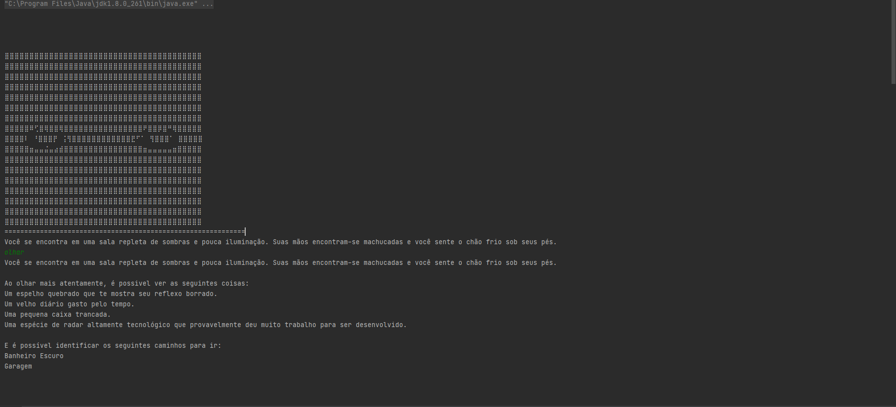
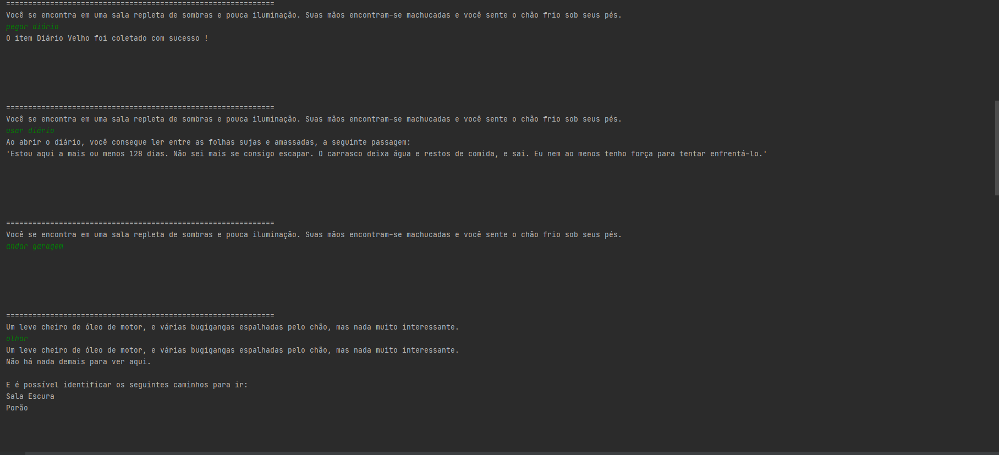
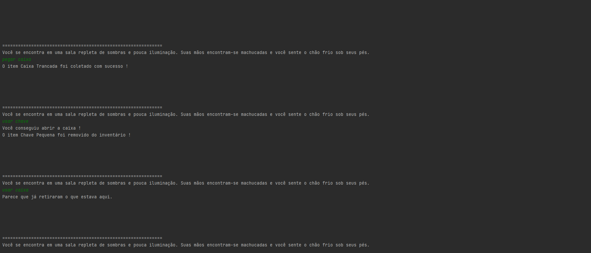

# Text Adventure Game 2.0

**Número da Lista**: -
**Conteúdo da Disciplina**: Programação Dinâmica

## Alunos
|Matrícula | Aluno |
| -- | -- |
| 14/0133305  |  Caio Felipe Dias Nunes |
| 15/0016018  |  Lucas Oliveira Silva |

## Sobre 
Uma melhoria do framework para desenvolvimento de jogos no estilo RPG de texto desenvolvido no módulo de Grafos 1 e Grafos 2, onde é possível desenvolver diversos jogos diferentes utilizando uma hierarquia simples. Nesta atualização, foi implementado um algoritmo de similaridade de strings que trabalha baseado na distância entre as teclas para corrigir erros de digitação do usuário ao digitar os comandos do personagem. Ainda há otimizações que podem ser realizadas no algoritmo, mas já apresenta resultados bastante satisfatórios.

## Screenshots

## Instalação 
**Linguagem**: Java
**Framework**: -  

**Pré-Requisitos**: 
JDK 8.0 ou Superior

## Uso 
O projeto trata-se de uma API de desenvolvimento de jogos em texto, onde apenas utilizando herança de algumas classes chave, é possível implementar um jogo completo, além de adicionar suas próprias particularidades.

Para começar a usar, tente dar uma olhada nas seguintes classes:

1. **ItemDesbloqueavel:** Classe que representa itens que necessitam de outros para serem destravados. Um baú, uma porta trancada, uma caixa de ferramentas lacrada, etc.
2. **ItemConsumível:** Classe que representa um item que possua cargas de uso, e após o término das cargas, será destruído. Uma poção de cura, uma garrafa de água, etc.
3. **ItemChave:** Classe que representa itens que são usados para desbloquear outros itens. Uma chave de uma porta, um alicate para quebrar cadeados, etc.
4. **ItemLegivel:** Classe que representa itens que possuem textos específicios. Livros, diários, cadernos, etc.
5. **Area:** Classe que representa uma area do seu mapa de jogo. Você pode extender essa classe para criar áreas com propriedades diferentes.

Para desenvolver seu jogo, você precisa criar Areas e adicioná-las ao mapa através do objeto **JogoController**. Este retorna um singleton do seu jogo, onde estarão armazenados os dados importantes. Você pode adicionar Itens a essas áreas, e conectá-las utilizando os métodos padrão da JogoController. Alguns métodos úteis:

1.**addArea().**   
2.**addItem().**   
3.**conectarArea().**   
4.**listarAreasJogo().**   
5.**imprimeMapaJogo().**   

As informações do jogador também podem ser acessadas pelo objeto **JogoController**, então não esqueça de dar uma olhada profunda nesta classe.

Também é interessante se aprofundar na classe **"InterpreteJogador"**. Ela é uma classe responsável por reconhecer comandos de terminal e reproduzir as ações correspondentes, através de chamadas polimórficas a métodos das classes pai (Item, Area, Personagem). As ações possíveis até o momento são:

1.**olhar.**   
2.**pegar.**   
3.**andar.**   
4.**usar.**   
5.**ler.**   

Caso deseje adicionar novas ações aos seus jogadores, apenas adicione um novo elemento ao Enum **"Acao"**, o seu correspondente tipo no enum **"TipoAcao"**, e a respectiva ação a ser executada no método **"agir"** dentro da classe **"InterpreteJogador"**.

Há um pequeno exemplo de utilização dessa API na classe **"Principal"**. Dê uma olhada, caso queira ter uma ideia do que é possível fazer e por onde começar.
